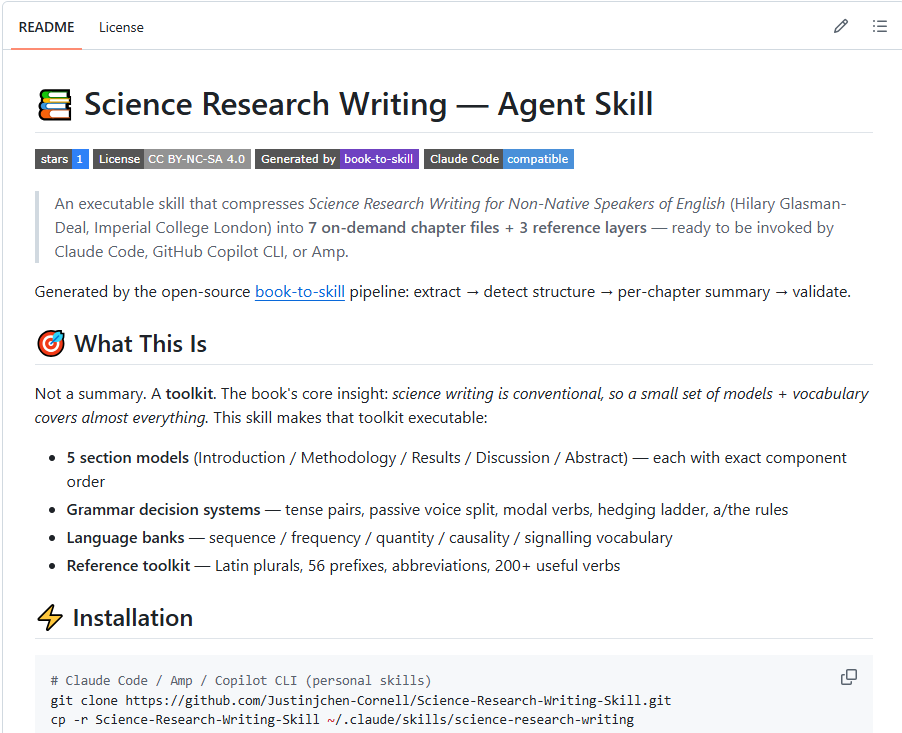

# 📚 Science Research Writing — Agent Skill

[](https://github.com/Justinjchen-Cornell/Science-Research-Writing-Skill/stargazers)
[](LICENSE)
[](https://docs.anthropic.com/en/docs/claude-code/skills)


> An executable skill that compresses *Science Research Writing for Non-Native Speakers of English* (Hilary Glasman-Deal, Imperial College London) into **7 on-demand chapter files + 3 reference layers** — ready to be invoked by Claude Code, GitHub Copilot CLI, or Amp.

Generated by the open-source [book-to-skill](https://github.com/virgiliojr94/book-to-skill) pipeline: extract → detect structure → per-chapter summary → validate.

## 🎯 What This Is

Not a summary. A **toolkit**. The book's core insight: *science writing is conventional, so a small set of models + vocabulary covers almost everything.* This skill makes that toolkit executable:

- **5 section models** (Introduction / Methodology / Results / Discussion / Abstract) — each with exact component order
- **Grammar decision systems** — tense pairs, passive voice split, modal verbs, hedging ladder, a/the rules
- **Language banks** — sequence / frequency / quantity / causality / signalling vocabulary
- **Reference toolkit** — Latin plurals, 56 prefixes, abbreviations, 200+ useful verbs

## ⚡ Installation

```bash
# Claude Code / Amp / Copilot CLI (personal skills)
git clone https://github.com/Justinjchen-Cornell/Science-Research-Writing-Skill.git
cp -r Science-Research-Writing-Skill ~/.claude/skills/science-research-writing
# or
bash install.sh        # macOS / Linux
install.ps1            # Windows (PowerShell)
```

Restart your agent session. Verify with:

```bash
# ask your agent:
#   "what chapters do you have?"  → lists the chapter index
#   "science-research-writing"    → loads core frameworks
```

## 🧭 Chapter Map

| # | Chapter | Key Frameworks |
|---|---------|----------------|
| 01 | [The Core Method](chapters/ch01-core-method.md) | Examine→Identify→Apply cycle, the Three Questions, symmetrical article shape, target-article protocol |
| 02 | [Introduction](chapters/ch02-introduction.md) | 4-part model, tense pairs, signalling language, sentence connection |
| 03 | [Methodology](chapters/ch03-methodology.md) | 4-part menu, passive standard-vs-own-work split, a/the rules, adverb safety |
| 04 | [Results](chapters/ch04-results.md) | 4-part menu, sequence/frequency/quantity/causality language, hedging ladder |
| 05 | [Discussion](chapters/ch05-discussion.md) | 4-part reverse model, modal-verb calibration, limitations as research directions |
| 06 | [Abstract & Title](chapters/ch06-abstract.md) | dual 5-part model, tense rules, title creation |
| 07 | [Reference Toolkit](chapters/ch07-reference-toolkit.md) | Latin/Greek plurals, 56 prefixes, abbreviations, useful-verbs bank |

Plus: [glossary.md](glossary.md) · [patterns.md](patterns.md) · [cheatsheet.md](cheatsheet.md) — the three always-on reference layers.

## 💬 Usage Examples

```text
"science-research-writing 帮我写 Methodology 开头"
→ loads ch03, applies the menu model, drafts the section

"science-research-writing 时态怎么选？标准程序和我的操作怎么区分？"
→ finds the passive tense-split rule (Present Simple passive = standard, Past Simple passive = your work)

"science-research-writing 用 hedging ladder 把这句话软化：
   The pressure drop caused the explosion."
→ applies the causality-softening chain and explains the trade-offs

"science-research-writing ch04 频率语言有哪些梯度？"
→ loads the 11-group frequency scale (always → never, with the 50% anchor)
```

## 🚀 See It Work — 60 Seconds

Try it yourself in one minute: open the [before/after demo](docs/demo.md) (broken draft → publication-ready abstract, every edit annotated) and fill in the [fillable templates](templates/) for your own paper.

## 📸 In Action



## 📚 Study Notes — Learn It With Me

Follow the complete 7-chapter study course, chapter by chapter, with worked examples and a full practice paper (a GOR-based asset allocation system) built live:

- [Start here: study map](docs/study-notes/00-学习地图.md)
- [Chapter notes index](docs/study-notes/README.md) — 7 chapters + real-paper annotation practice

Every chapter: explanation → worked case → practice → self-check list.

## 📐 Reuse the Template — Turn Any Book into a Course

The 7-chapter study course above was produced with a reusable template pack. Fork it and apply it to any book:

- [Template pack](docs/study-template/README.md) — 4-step workflow + 4 file templates (study map / chapter notes / material annotation / practice work)
- Book-type adaptation guide (methodology / mental-model / manual / industry-analysis books)

## 📖 About the Book


**Science Research Writing for Non-Native Speakers of English** · Hilary Glasman-Deal · Imperial College Press (2010).
A 30-year EAP practitioner's do-it-yourself manual: examine good examples → identify structure, grammar, vocabulary → apply them in your own writing. Aimed at IELTS 6.0+ / TOEFL 550+.

## 👤 About the Author

**Justin Chen** — 16-year private equity investor (Tsinghua PBCSF / Cornell Johnson MBA) building *book-skills*: a planned series that turns influential books into executable agent skills. This repo is the first volume; framework content is licensed for learning, so fork it, adapt it, and make it yours.

---

## 📜 License & Copyright

- **This repository** contains only the author's condensed framework notes and reformulated explanations — **no full text of the book** (only brief, fair-use quotations used to illustrate grammar points).
- **Framework content**: CC BY-NC-SA 4.0 (see [LICENSE](LICENSE)).
- **The book and its quoted excerpts**: © 2010 Imperial College Press / World Scientific. All rights reserved. This project is **not affiliated with** nor endorsed by the publisher or author.
- Book excerpts are quoted solely for educational illustration and remain the property of their rights holders.

## 🤝 Related

- [book-to-skill](https://github.com/virgiliojr94/book-to-skill) — the open-source pipeline that generated this skill
- *Planned*: more books in this series (goal: a library of book-skills, one per influential text)
